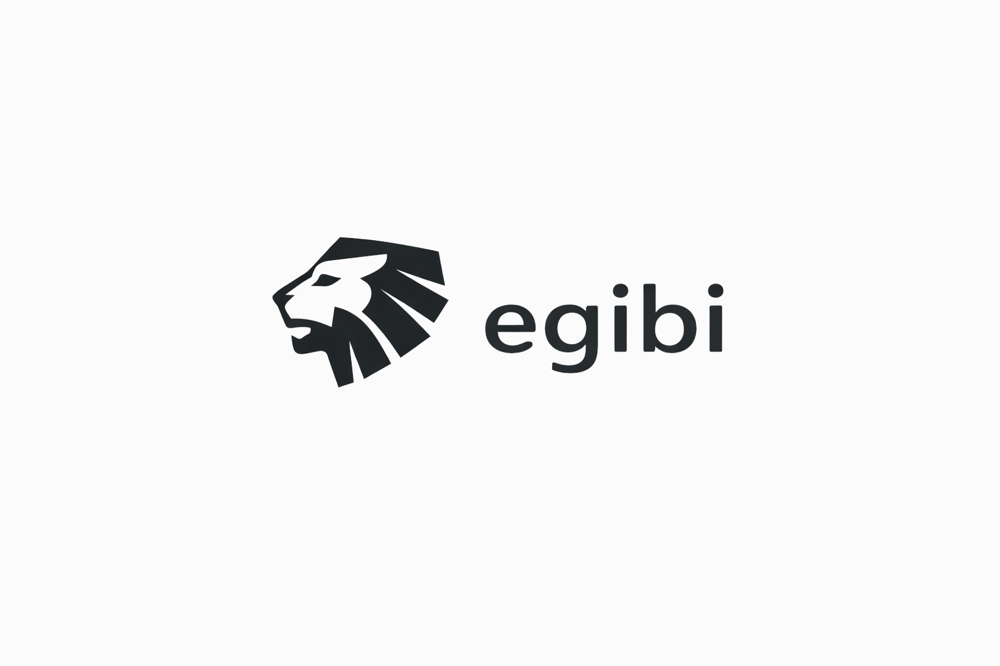

<p align="center">
  
</p>

<h3 align="center">Multi-Asset Algorithmic Trading Platform — UI</h3>

<p align="center">
  Angular 21 frontend for strategy management, backtesting, and multi-exchange trading
</p>

<p align="center">
  <a href="#quick-start">Quick Start</a> •
  <a href="#features">Features</a> •
  <a href="#project-structure">Project Structure</a> •
  <a href="#routes">Routes</a> •
  <a href="https://github.com/egibi/egibi-api">Backend Repo</a>
</p>

---

## Overview

Egibi UI is the Angular frontend for the Egibi algorithmic trading platform. It provides a dashboard for designing trading strategies with technical indicators, running backtests against historical market data, managing cryptocurrency exchange accounts, and connecting bank accounts through Plaid.

## Tech Stack

| Category | Technology |
|---|---|
| Framework | Angular 21 (standalone components, signals, reactive forms) |
| Styling | Bootstrap 5.3 via SCSS |
| UI Components | NgBootstrap 20 (modals, dropdowns, tabs, tooltips) |
| Data Tables | AG Grid 35 (sorting, pagination, filtering) |
| Charts | Highcharts 12 (candlestick and time-series) |
| Real-time | Microsoft SignalR (notifications, file upload progress) |
| Banking | Plaid Link (bank account connection) |
| MFA | QRCode generation for TOTP setup |
| Markdown | Marked (in-app documentation rendering) |
| Drag & Drop | ngx-file-drop (file upload) |

## Prerequisites

- [Node.js 22+](https://nodejs.org/) (LTS recommended)
- [Angular CLI 21](https://angular.dev/tools/cli) — `npm install -g @angular/cli`
- A running instance of [egibi-api](https://github.com/egibi/egibi-api) at `https://localhost:7182`

## Quick Start

### 1. Clone

```bash
git clone https://github.com/egibi/egibi-ui.git
cd egibi-ui
```

### 2. Install Dependencies

```bash
npm install
```

### 3. Start the Dev Server

```bash
ng serve
```

The app runs at `http://localhost:4200` and expects the API at `https://localhost:7182` (configured in `src/environments/environment.ts`).

## Features

### Strategy Builder
Design algorithmic trading strategies using configurable technical indicators with entry and exit rules. Strategies are saved and versioned through the API.

### Backtesting Engine
Run strategies against historical OHLC data to evaluate performance. View detailed results including profit/loss, trade history, and equity curves rendered with Highcharts.

### Exchange Account Management
Connect cryptocurrency exchange accounts (Binance, Coinbase, Kraken) with encrypted API credential storage. Test connections and manage fee structures through a tabbed detail interface.

### Funding & Banking
Connect personal bank accounts via Plaid Link for balance visibility. Requires MFA to be enabled before accessing financial integrations. Supports user-provided Plaid developer credentials encrypted per-user.

### Market Data
Browse available markets and symbols across connected exchanges. Import and manage historical OHLC data through the Data Manager with file upload support via drag-and-drop.

### Security
TOTP-based multi-factor authentication with QR code setup, backup recovery codes, and MFA verification for sensitive operations. All authentication flows use OAuth 2.0 with automatic token refresh.

### Admin Dashboard
User management, service catalog configuration, and system monitoring for admin-role users.

## Project Structure

```
egibi-ui/
├── src/
│   ├── app/
│   │   ├── _charts/                # Highcharts wrapper components
│   │   ├── _components/            # Shared UI components
│   │   │   ├── breadcrumb/         # Navigation breadcrumbs
│   │   │   ├── egibi-modal/        # Reusable modal wrapper
│   │   │   ├── egibi-table/        # AG Grid table wrapper
│   │   │   ├── file-drop/          # File upload drop zone
│   │   │   └── toast/              # Toast notifications
│   │   ├── _layout/                # App shell (header, sidebar)
│   │   ├── _models/                # TypeScript interfaces and enums
│   │   ├── _services/              # Shared Angular services
│   │   ├── _signalr-services/      # SignalR connection management
│   │   ├── _utilities/             # Helper functions
│   │   ├── accounting/             # Financial tracking
│   │   ├── accounts/               # Exchange account management
│   │   ├── admin/                  # Admin panel (users, services)
│   │   ├── api-tester/             # Exchange API connection testing
│   │   ├── app-configuration/      # User app settings (Plaid config)
│   │   ├── auth/                   # Login, signup, MFA, password reset
│   │   ├── backtester/             # Backtest management and results
│   │   ├── data-manager/           # Data provider and OHLC management
│   │   ├── documentation/          # In-app docs (markdown-based)
│   │   ├── funding/                # Bank account connections (Plaid)
│   │   ├── home/                   # Dashboard
│   │   ├── markets/                # Market catalog
│   │   ├── security/               # MFA setup and management
│   │   ├── service-configurations/ # Service catalog configuration
│   │   ├── storage/                # File management
│   │   ├── strategies/             # Strategy builder and detail views
│   │   └── setup-wizard/           # Onboarding flow
│   ├── assets/                     # Static assets and documentation markdown
│   └── environments/               # Environment configurations
├── angular.json                    # Angular workspace config
├── package.json                    # Dependencies and scripts
└── tsconfig.json                   # TypeScript configuration
```

## Routes

### Public Routes

| Route | Component | Description |
|---|---|---|
| `/auth/login` | Login | User authentication |
| `/auth/signup` | Signup | New account registration with consent |
| `/auth/forgot-password` | ForgotPassword | Password recovery initiation |
| `/auth/reset-password` | ResetPassword | Password reset completion |
| `/auth/mfa-verify` | MfaVerify | MFA verification during login |
| `/privacy-policy` | LegalPage | Privacy policy document |
| `/terms-of-service` | LegalPage | Terms of service document |

### Protected Routes (require authentication)

| Route | Component | Description |
|---|---|---|
| `/` | Home | Dashboard |
| `/strategies` | Strategies | Strategy list with AG Grid |
| `/strategies/:id` | StrategyDetail | Strategy builder, backtest config, results |
| `/backtester` | Backtester | Backtest management grid |
| `/backtester/backtest/:id` | Backtest | Individual backtest detail |
| `/accounts` | Accounts | Exchange account list |
| `/accounts/account/:id` | Account | Account detail (credentials, fees, testing) |
| `/funding` | Funding | Bank account connections via Plaid |
| `/markets` | Markets | Market catalog |
| `/data-manager` | DataManager | Data provider list |
| `/data-manager/data-provider/:id` | DataProvider | Provider detail and OHLC management |
| `/storage` | Storage | File management |
| `/accounting` | Accounting | Financial tracking |
| `/security` | Security | MFA setup and management |
| `/app-configuration` | AppConfiguration | User settings (Plaid credentials) |
| `/service-configs` | ServiceConfigurations | Service catalog config |
| `/documentation` | Documentation | In-app platform docs |
| `/api-tester` | ApiTester | Exchange API testing tool |

### Admin Routes (require admin role)

| Route | Component | Description |
|---|---|---|
| `/admin` | Admin | User management and system administration |

## Styling

The app uses Bootstrap 5 via SCSS. The global `styles.scss` imports Bootstrap at the top:

```scss
@use 'bootstrap/scss/bootstrap';
```

## Authentication Flow

1. User enters credentials on the login page
2. `AuthService` posts to `/auth/login`, which sets an HTTP cookie
3. A silent redirect to `/connect/authorize` obtains an authorization code
4. The code is exchanged for access and refresh tokens at `/connect/token`
5. `AuthInterceptor` attaches the bearer token to all API requests
6. Tokens are refreshed automatically before expiry
7. If MFA is enabled, user is redirected to `/auth/mfa-verify` after initial login

Route guards (`authGuard`, `adminGuard`) protect routes and redirect unauthenticated users to login.

## Environment Configuration

**Development** (`src/environments/environment.ts`):
```typescript
export const environment = {
  production: false,
  name: 'Development',
  tag: 'DEV',
  apiUrl: 'https://localhost:7182'
};
```

**Production** (`src/environments/environment.production.ts`):
```typescript
export const environment = {
  production: true,
  name: 'Production',
  tag: 'PROD',
  apiUrl: 'https://api.egibi.io'
};
```

## Build

```bash
ng build                            # Development build
ng build --configuration production # Production build
```

Build output goes to `dist/egibi-ui/`.

## Related

- **Backend** — [egibi-api](https://github.com/egibi/egibi-api)
- **Organization** — [github.com/egibi](https://github.com/egibi)

## License

Proprietary — Egibi LLC
